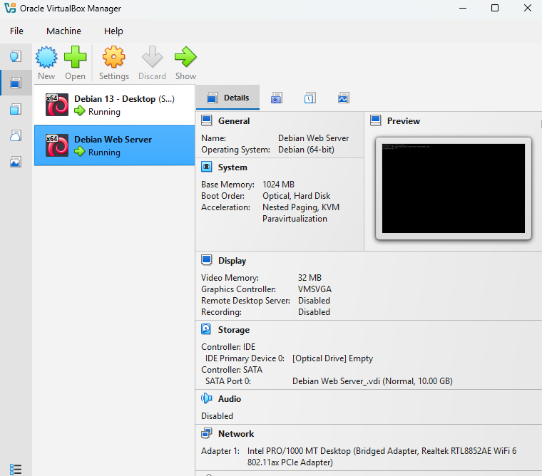
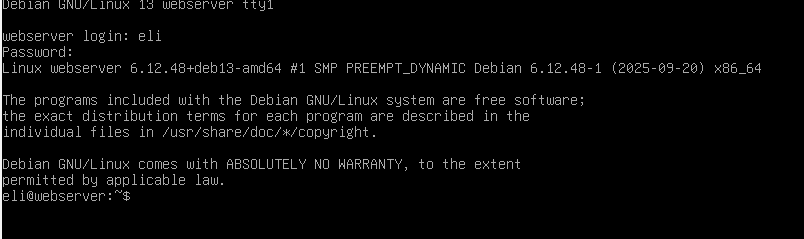
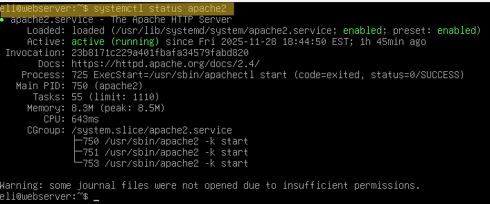
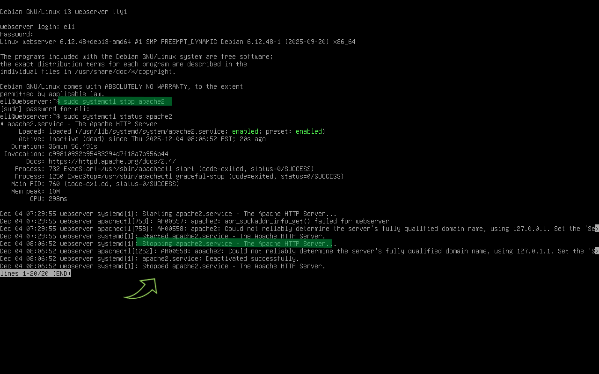
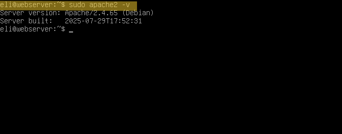

# Deliverable 2

## 1. What are the server hardware specifications (virtual machine settings)? Take a screenshot - don’t type it!

## 2. What is the Debian Login Screen?

## 3. What is the IP address of your Debian Server Virtual Machine? (type the command and show a screenshot of the commands output)
The command to see the *IP address* on Debian server Virtual Machine is `hostname -I`
- The *IP address* for this machine is `192.168.1.159`

## 4. How do you work with the Firewall in Debian?

In Debian, the firewall is commonly managed using **UFW (Uncomplicated Firewall)**.

**UFW Command**

**Description**: 
UFW is a user friendly command-line tool that helps you enable, disable, and configure firewall rules on Debian. It controls what network traffic is allowed or denied

**Formula/Syntax**: 
`sudo ufw allow OpenSSH`

**Examples**:
 a. How do you check if the Firewall is running?
- By using the command `sudo ufw status` 
-  Explanation: Shows whether the firewall is active and lists any rules currently applied 

b. How do you disable the Firewall?
- By using `sudo ufw disable`
- Turns the firewall off and stops enforcing rules 

c. How do you add Apache to the Firewall?
- `sudo ufw allow 'WWW Full'` *(WWW Full allow HTTP+HTTPS)*
- Explanation: 
Allows web traffic on ports 80(HTTP) and 443 (HTTPS), enabling Apache to work properly.

# 5. What different commands do we use to work with Apache? 

a. What is the command you use to check if Apache is running?
- The command is `systemctl status apache2`
- - Shows whether Apache is active,inactive, or failed. It also display uptime and recent log messages.
- 

b. What is the command you use to stop Apache?
- The command is `sudo systemctl stop apache2`
- - Stops the Apache service immediately.Useful when applying configuration changes that require a clean shutdown
- 

c. What is the command you use to restart Apache?
- The command is `sudo systemctl restart apache2`
- - Fully stops and then starts Apache. Use this after major configuration updates.

d. What is the command used to test Apache configuration?
- The command is `sudo apache2ctl configtest`
- - Checks for syntax errors in Apache configuration files before restarting. Super important so you don't break the server.

e. What is the command used to check the installed version of Apache?

- The command is `apache2 -v`
- - Displays the installed version and build information for Apache
- 

f. What are some common configuration files for Apache?

Some of the most common configuration files for Apache are :

- /etc/apache2/apache2.conf - **Main Apache configuration file**

- /etc/apache2/ports.conf - **Defines which ports Apache listens on**

- /ete/apache2/sites-available/ - **Stores site (virtual host) configs available but not enabled.**

- /etc/apache2/sites-enabled/ - **Contains symlinks to active sites**

- /etc/apache2/mods-available/- **All available modules**

- /etc/apache2/mods-enabled/- **Symlinks to enabled modules**

g. Where does Apache store logs?

Apache logs are stored in: 
`/var/log/apache2/`

Common log files:
- access.log- every web request
- error.log - server errors, warnings, and startup messages.

h. What are some basic commands we can use to review logs?

View last 10 line of the error log :
`tail /var/log/apache2/error.log`

Follow the log in real time :
`tail -f /var/log/apache2/error.log`

View the access log :
`less /var/log/apache2/access.log`