# Lab 8 

## Question 1 

**P1**
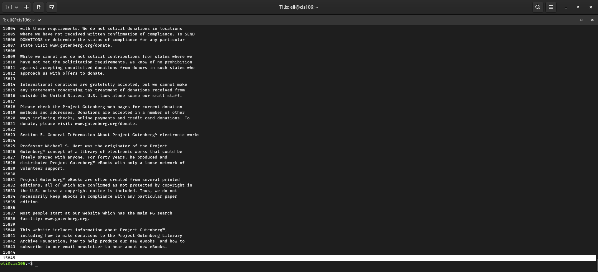

**P2**
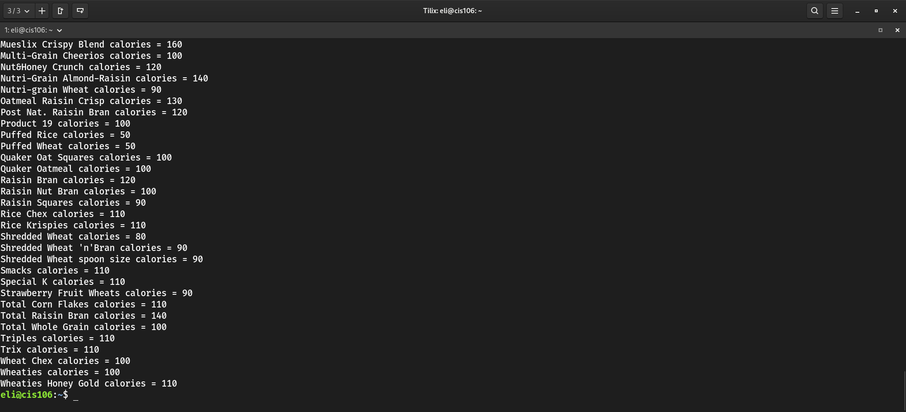

**P3**
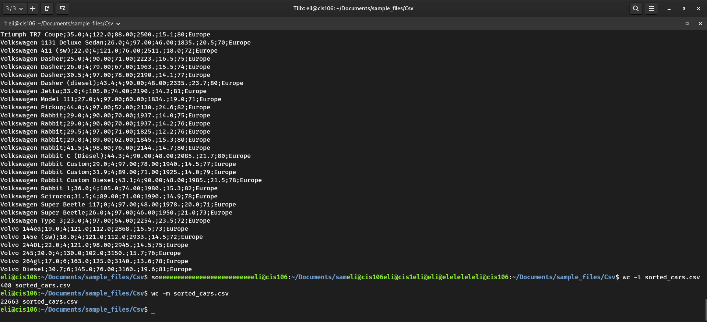

## Question 2 Challenge

**q2.1 Command Used**
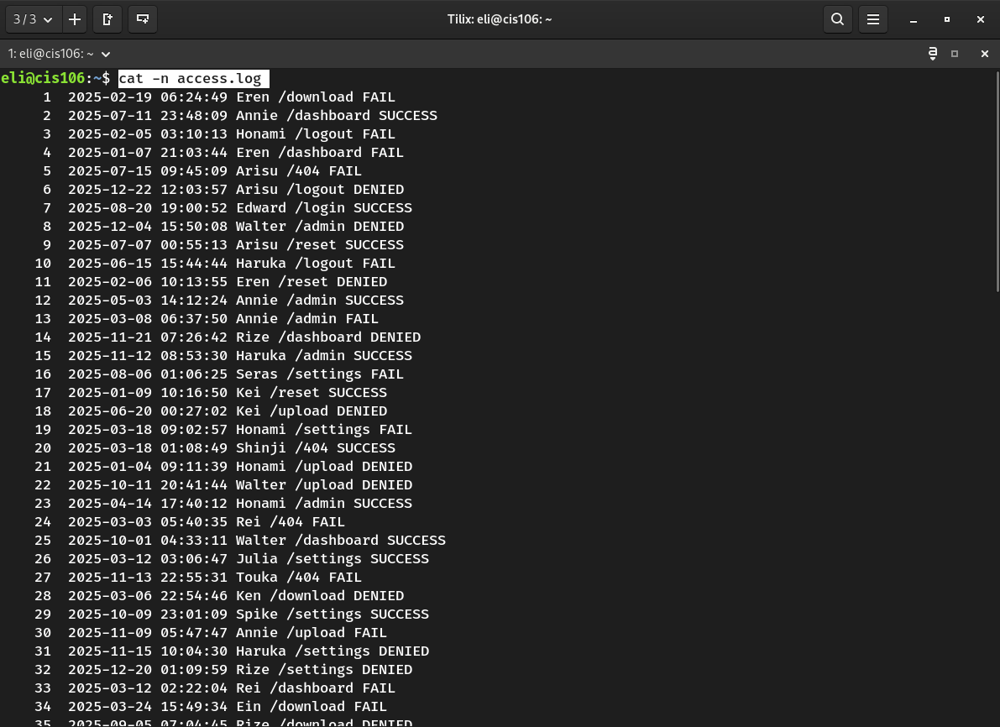

**q2.1 answer**
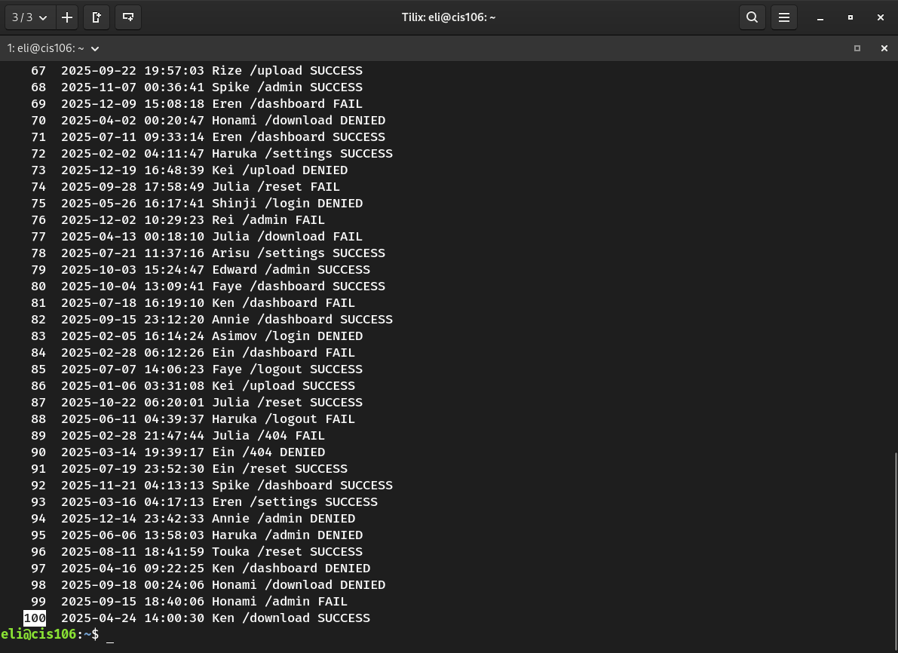

**q2.2**
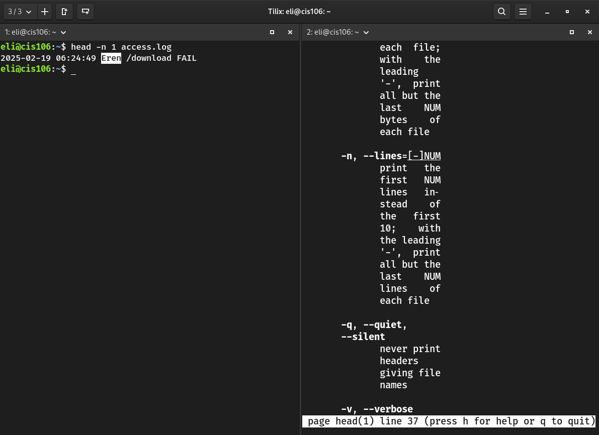

**q2.3**
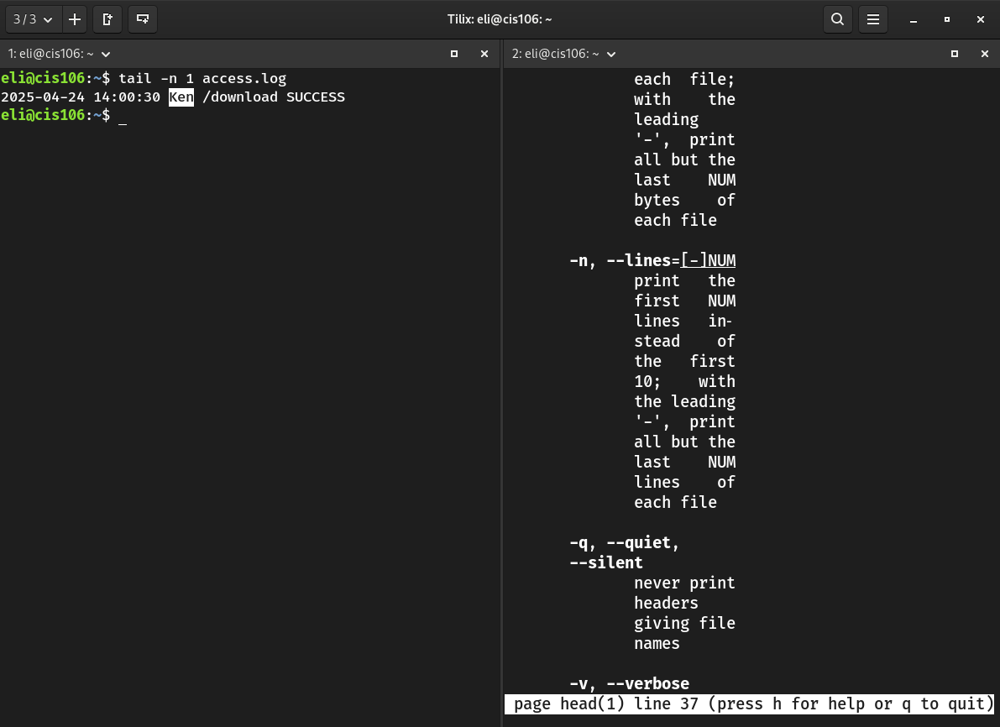

**q2.4**

**q2.5**
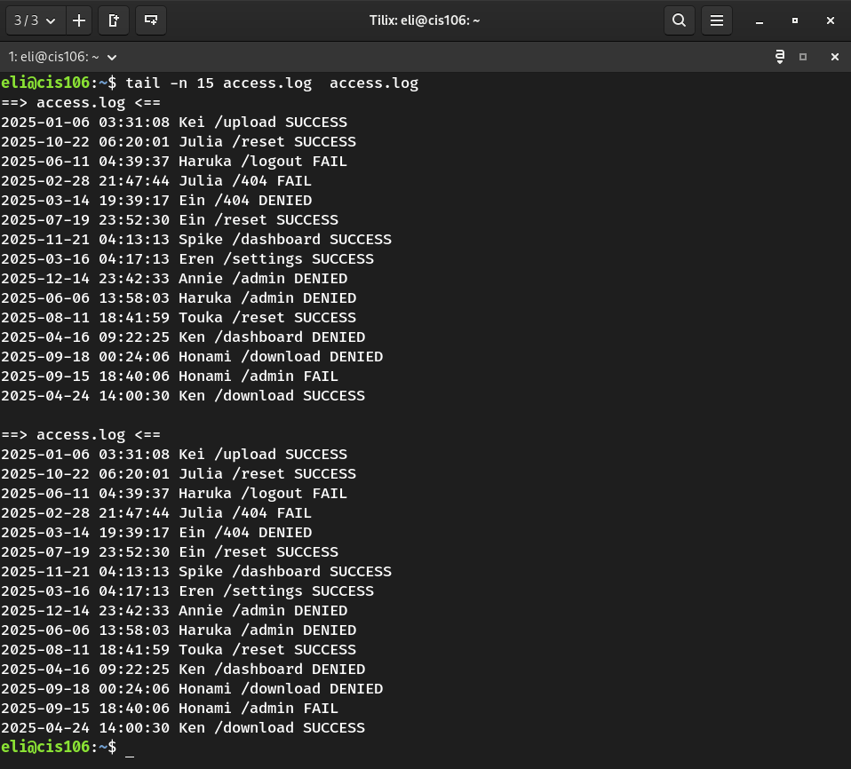

**q2.6**

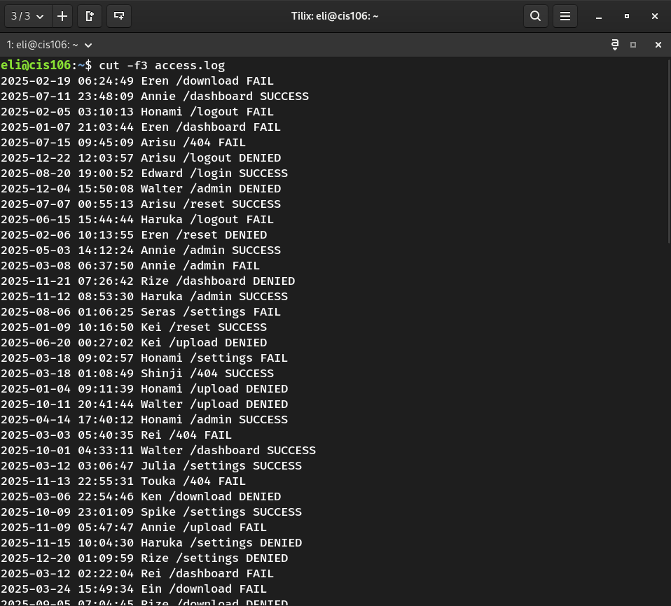

**q2.7** 

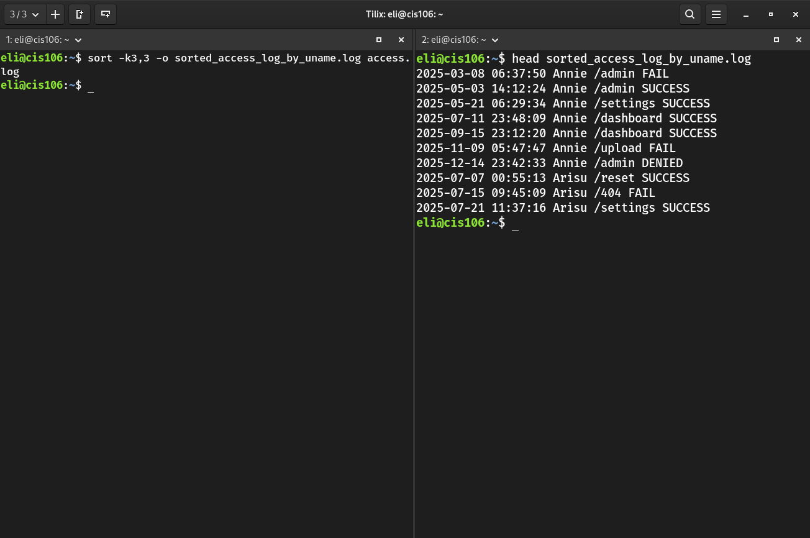

**q2.8**

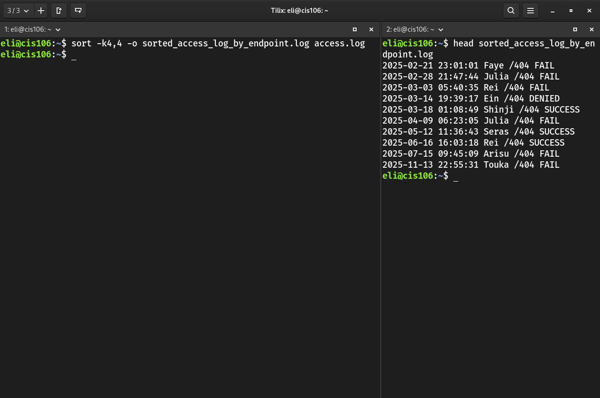

**q2.9**

