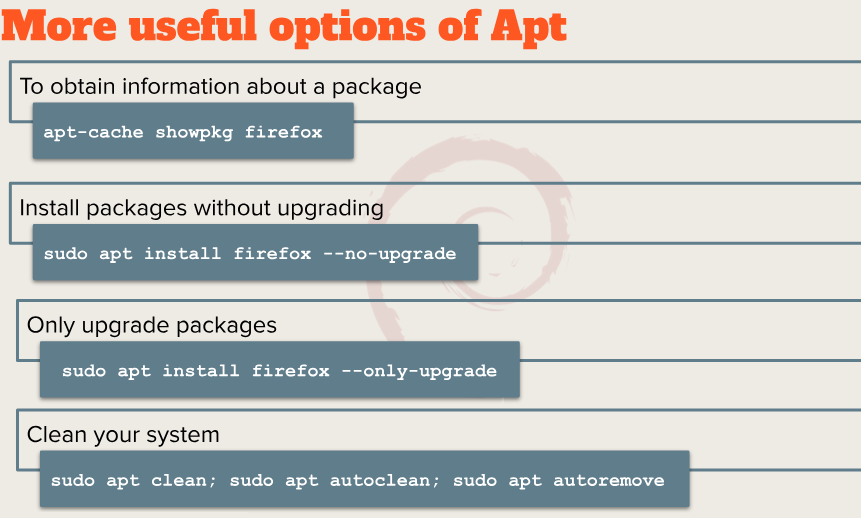

# Notes 4

## How to install and remove software using the APT command 
The APT command is what Linux systems like Debian use to manage software.
- Its a tool that lets you install, update, remove, and clean up software programs. It's all done from the terminal
____
**When I want to install a new program, I can use this command**
`sudo apt install then the "Package-name`
___
`sudo` - gives administrator permission.

`apt` - the actual package manager tool that handles software

`install` - tells APT that you want to add a program

`package-name`- the name of the program you want to install.

Example: 
`sudo apt install figlet`
1. It will connect to Linux software repository
2. Download the figlet program
3. Install it and set it up so I can run it from the terminal.
----
Now the same goes for removing a software:
`sudo apt remove(then the package name)`

`sudo apt purge "package name"`

___
`remove `  - options will remove the package but the configurations may still be there so then you can use the 
`purge` - options to completely remove everything related to that software (like doing a clean unistall)

`*Pro tip - *when installing and removing a program, system save left over files called cache and dependencies(extra small programs that were installed to help another program run).Over time, these files can take up space, so it's a good habit to clean them once in a while*`

Here are some commands for that:
`sudo apt clean` - deletes all downloaded installation file stored in /var/cach/apt/archives

`sudo apt autoclean` - deletes only old setup files that can't be downloaded again

`sudo apt autoremove` - removes software packages that were automatically installed as dependencies but are no longer needed

### Useful examples

## How to create a shell script step by step including screenshots and how to run it. Try to be as detailed as possible.

##  What is a Shell Script?
A shell script is a text file that contains Linux commands written in order.  
When you run it, the computer follows each command line by line.  
It’s like giving your computer a to-do list.

---

##  Step 1 — Open  Text Editor
1. Open **Gnome Text**  
2. Type this at the top of your file:
`#!/bin/bash` - *This is called a (shebang) which tells linux to use the Bash shell*

3. Add any commands you want below it. 

The `echo` command is used for displaying/printing text to the screen.
A `string`  is a data type that represent text. 
- Its like a sentence or a word anything that is made up of letters,numbers, spaces, or symbols.

**Formula/Syntax** = `echo + option + "string"`

Options can be viewed in the terminal with the command `man echo`

**Here is an example of commands to say under `shebang`:**

1. ` echo `"Hello, this is my first shell script!"
`date`
`whoami`
`free` -h

---
2. `echo` - "Hello world" 
3. `echo -e`- "Line 1\nLine2"
4. `echo -n` -  "Hello World"

Save the file with any name  with a `.sh` extension, like 

**"`myscript.sh`"**

## Step 2 - Run the script 

1. Open the **terminal**
2. From the terminal, go into the folder where the script is saved
`cd path/to/your/folder`
`cd scripts/(folder) (or wherever its saved at)`

*"Once in the folder in the terminal"*
3. Run the script
`bash myscript.sh`
