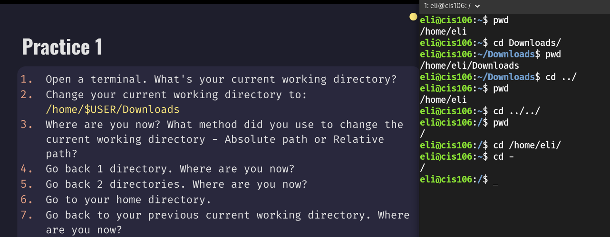
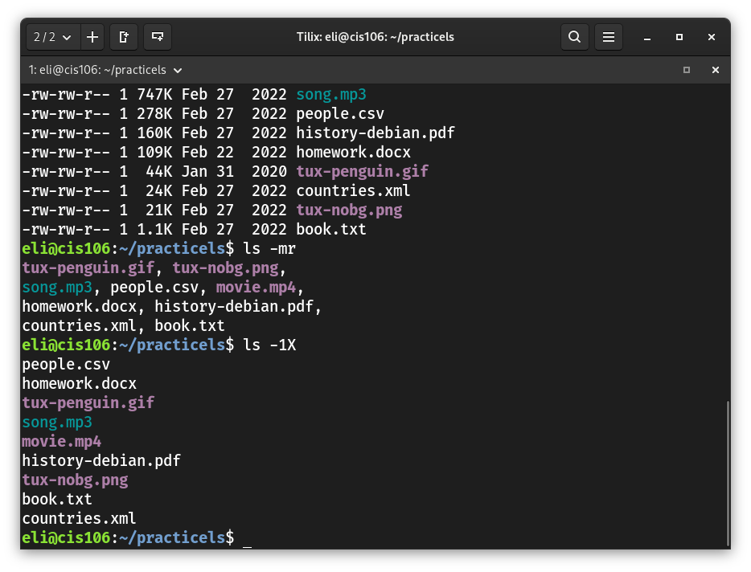
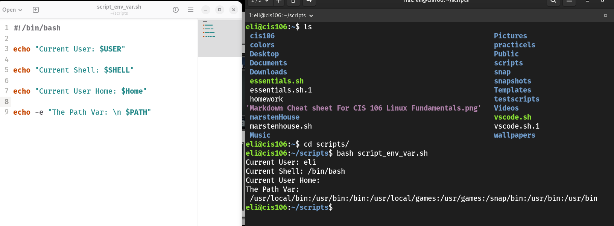
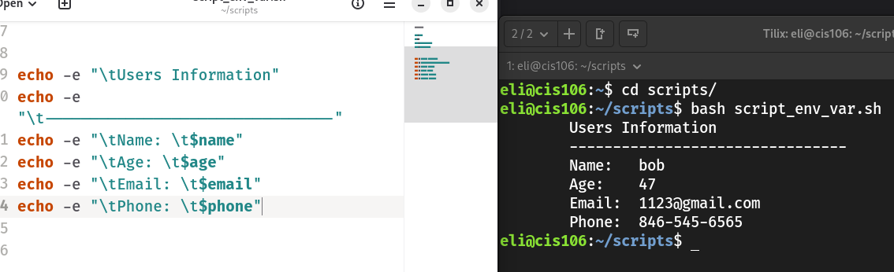

## Week Report 5 

## The File system Practice Questions 

1. The Linux Filesystem:
### Practice 1

### Practice 2

### Practice 3
Didnt finish (reminder to self to come back to finish)

---

2. Shell Scripting Chapter 2

### Practice 2

### Practice 3

---
## Notes5
[Notes 5](../../notes/notes5/notes5.pdf)

## Lab5
[Lab5](../../labs/lab5/lab5.pdf)

